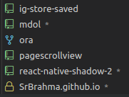
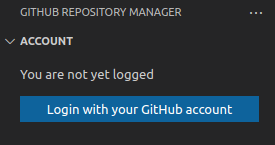
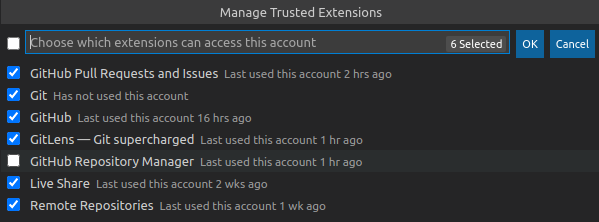
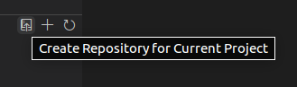

<h1 align="center">
<b>GitHub Repository Manager</b>
</h1>

<h3 align="center">
VS Code extension that lists your personal and organizations GitHub repositories, allowing you to clone and access them and create new ones
</h3>

 

 

_This gif is a little old! We are now using the VS Code integrated GitHub login system and the extension is prettier! The gif will be eventually updated!_

 

_The `*` means that the repository is **dirty**! So it has local changes that aren't yet commited!_

<h1 align="center">
Guide
</h1>

<!-- Maybe not needed. See if someone asks on how to do it. <h2><b> Log in </b></h2>

**[1.0.0]** We are now using the VS Code integrated GitHub login system!

<h2><b> Log out </b></h2>

To logout in this new VS Code system, remove it from the Trusted Extensions. In the next VS Code session, the extension won't have access to your account. Note that if

  -->

<h2><b> Cloned Repositories Search </b></h2>

To make your GitHub cloned repositories show up in the **Cloned** tree view, you will need to set the **`"git.defaultCloneDirectory"`** in your VSCode `settings.json` to the path your cloned repositories are located (they may be deeply located there).

**1.4.0** - there is now a button to set this config interactively!

<h2><b> Creating a repository </b></h2>

By hovering the **REPOSITORIES** tree view title, a **+** button appears. Click on it, enter the new repository name, description (optional) and visibility. On success, you may choose to clone the new repository.

If you are a member of at least one organization that allows you to create repositories for it, it will be asked, before the repository name input, to pick the new repository owner: your own account or one of those organizations.

<h2><b> Creating a repository for current project </b></h2>

You may create a GitHub repository and push your current project within the same flow. If there are multiple folders in your workspace that may be published to GitHub, it will be prompted to pick one.

There are 2 possible cases that allows using that publish functionality:

1) **Your project doesn't have a Git yet.** After entering the repository name, description and visibility, the repository will be created, the git will be initialized for the workspace folder, `main` branch will be created and selected, GitHub remote will be added as `origin` and your files will then be pushed to it.

2) **Your project has a Git, but it hasn't a remote yet.** After filling the repository information, it will be checked if your git HEAD is `master`. If so, it will ask if you want the branch to be renamed to `main`. Then the repository will be created, the GitHub remote is added as `origin` and your code is pushed.

 
<h1 align="center"> Settings </h1>

- ### Always Clone To Default Directory
##### _"githubRepositoryManager.alwaysCloneToDefaultDirectory"_
Always clone to the directory specified in "git.defaultCloneDirectory".
##### Default: **false**

- ## Default Clone Directory Maximum Depth
##### _"githubRepositoryManager.clonedRepositoriesSearch.defaultCloneDirectoryMaximumDepth"_
How deep on `"git.defaultCloneDirectory"` the cloned repositories will be searched. A depth of 0 means it will only search in the directory itself, a depth of 3 means it will search up to 3 directories below. The lesser the faster.
##### Default: **2**

- ## Directories To Ignore
##### _"githubRepositoryManager.clonedRepositoriesSearch.directoriesToIgnore"_
Directories names that are ignored on the search for the cloned repositories. `**/` is added to their start.
##### Default: **["node_modules", ".vscode", ".git/*", "logs", "src", "lib", "out", "build"]**

 

<h1 align="center">
  <a href="https://github.com/SrBrahma/GitHub-Repository-Manager/blob/master/CHANGELOG.md">
      Changelog
  </a>
</h1>

<h1 align="center"> Roadmap </h1>

- Search and clone public repositories

- Other repositories found by the Cloned Repository Searcher. Useful for quickly opening a repository you don't own.

- Visualize without cloning (useful for getting some value or checking something from some repository)

- "Order by" (alphabetically, stars, your open frequency, created on, updated on) in top menu

- Search repository by name

- Fetch repositories on demand - Some devs have hundreds or thousands of repos. Instead of fetching all of them on init and displaying all of them together, there could be a \[1..100\], \[101, 200\] tree system, for both on demand fetch and display.

- Remove cloned from local if it isn't dirty (= not locally diff from github)

 
<h2 align="center"> Feel free to open an issue for features requests, problems or questions! </h2>

<h4 align="center">

For developing: clone it, run `npm i`, `npm start` and run the debugger.

</h4>

 
<h1 align="center"> Donation </h1>

<h3 align="center">
  Help me to keep and improve this project!
   
</h3>

<!-- Without this div, it wasn't being centered on the marketplace. -->

